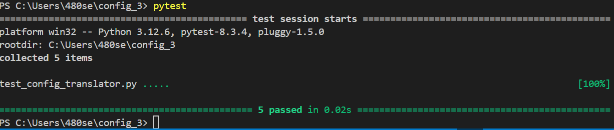

# ДОМАШНЯЯ РАБОТА ПО КОНФИГУРАЦИОННОМУ УПРАВЛЕНИЮ №3 ЧУМАКОВ С.Ю. ИКБО-43-23 #

# КОНВЕРТЕР КОНФИГУРАЦИИ В ФОРМАТ TOML #

Вариант №30: Разработать инструмент командной строки для учебного конфигурационного
языка, синтаксис которого приведен далее. Этот инструмент преобразует текст из
входного формата в выходной. Синтаксические ошибки выявляются с выдачей
сообщений.
Входной текст на учебном конфигурационном языке принимается из
стандартного ввода. Выходной текст на языке toml попадает в файл, путь к
которому задан ключом командной строки.

Массивы:
#( значение, значение, значение, ... )
Имена:
[_a-zA-Z]+
Значения:
• Числа.
• Массивы.
Объявление константы на этапе трансляции:
let имя = значение
Вычисление константы на этапе трансляции:
@{имя}
Результатом вычисления константного выражения является значение.
Все конструкции учебного конфигурационного языка (с учетом их
возможной вложенности) должны быть покрыты тестами. Необходимо показать 3
примера описания конфигураций из разных предметных областей.

**1. ОБЩЕЕ ОПИСАНИЕ.**

Этот проект реализует программу для преобразования конфигурационных файлов из собственного формата в формат TOML. Входные данные представляют собой текстовый файл, содержащий объявления переменных и арифметические выражения. Программа парсит конфигурацию, вычисляет выражения и конвертирует их в формат TOML.

Основные особенности:
- Поддержка констант и арифметических выражений.
- Преобразование в формат TOML.
- Поддержка массивов и операций с константами.

**2. ОПИСАНИЕ ВСЕХ ФУНКЦИЙ И НАСТРОЕК**

Основные функции:

```Парсинг входного файла``` :   Программа анализирует строки в конфигурационном файле и распознает объявления констант, массивов и арифметических выражений. Это позволяет гибко работать с текстовыми конфигурациями, содержащими различные виды данных.

```Конвертация в TOML``` : Все распознанные данные, такие как переменные, массивы и вычисляемые константы, конвертируются в формат TOML, который является удобным для использования в других приложениях и системах конфигурации.

```Поддержка арифметических операций``` : Программа поддерживает базовые операции (сложение, вычитание, умножение, деление) между константами.

```Поддержка массивов``` : Программа может обрабатывать массивы чисел, что расширяет возможности работы с данными в конфигурации, включая их использование в вычислениях.


Настройки:
```pip install pytest``` : Для правильного запуска тестов


**3. ОПИСАНИЕ КОМАНД ДЛЯ СБОРКИ ПРОЕКТА**
Вид команды: 

```python config_translator.py <наш конфигурационный файл.txt> <название файла для конвертации.toml>```

Пример команды:

**python config_translator.py input_config.txt output_config.toml**


Для запуска тестов используется команда:

```pytest```

**4. ПРИМЕРЫ ИСПОЛЬЗОВАНИЯ:**


```Пример входного файла (input_config.txt)``` :


```Пример выходных данных (output_config.toml)``` :


**5. РЕЗУЛЬТАТЫ ПРОГОНА ТЕСТОВ:**



